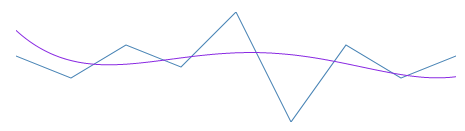

////

|metadata|
{
    "name": "igsparklineview-trend-lines",
    "tags": ["Charting","Getting Started","How Do I","Styling"],
    "controlName": ["IGSparklineView"],
    "guid": "86c3e2ca-be2b-47f0-bc15-43e8d2b401a1",  
    "buildFlags": [],
    "createdOn": "2013-08-26T18:31:03.9236381Z"
}
|metadata|
////

= Trend Lines

== Topic Overview

=== Purpose

This topic provides an introductory overview of displaying trend lines on the  _IGSparklineView_™ control.

=== In this topic

This topic contains the following sections:

* <<_Ref235847017, Trend Lines >>

** <<_Ref329132134,Introduction>>
** <<_Ref327864136,Trend line types>>

* <<_Ref324841253, Related Content >>

[[_Ref235847017]]
== Trend Lines

[[_Ref329132134]]

=== Introduction

Trend lines are lines drawn from the starting plotted value to the last plotted value indicating the trending direction and movement of the series so that the viewer can evaluate the tendencies in the rendered data and mentally extrapolate past, future, or unknown values.

The trend line feature enables you to choose among several formulas for generating a trending directional line. The formula to use is specified in the `trendLineType` property. The trend line renders in front of the series data, so it is always visible.

[[_Ref327864136]]

=== Trend line types

[[_Ref235847054]]
The following table displays the supported trend line types. Each trend line type is drawn based on the calculation formula of its type.

[options="header", cols="a,a,a"]
|====
|Trend Line Type|Description|Preview

|`IGTrendLineTypeSimpleAverage`
|Simple Average is a set of numbers, each of which is the average of a corresponding subset of data points. Also known as Simple Moving Average.
|image::images/IGSparklineView_-_Trendlines_2.png[]

|`IGTrendLineTypeModifiedAverage`
|Modified Average shows the moving average value over a set period. Used to emphasize the direction of the trend and smooth out the fluctuation.
|image::images/IGSparklineView_-_Trendlines_3.png[]

|`IGTrendLineTypeExponentialAverage`
|Exponential Average is similar to simple average with weight factor added to it. This type of average is known to react faster to recent changes of the trend.
|image::images/IGSparklineView_-_Trendlines_4.png[]

|`IGTrendLineTypeCumulativeAverage`
|Cumulative Average is an ordered pair of representing the cumulative calculated average of all data up to the current point.
|image::images/IGSparklineView_-_Trendlines_5.png[]

|`IGTrendLineTypeWeightedAverage`
|Weighted Average is any average that applies a multiplying factor, giving weight to data at different positions.
|image::images/IGSparklineView_-_Trendlines_6.png[]

|`IGTrendLineTypeCubicFit`
|Uses polynomial mathematical functions to specify a cubic fit trend line on a series.
|image::images/IGSparklineView_-_Trendlines_7.png[]

|`IGTrendLineTypeExponentialFit`
|Uses exponential mathematical functions to specify an exponential fit trend line on a series.
|image::images/IGSparklineView_-_Trendlines_8.png[]

|`IGTrendLineTypeLinearFit`
|The best-fitting straight trend line.
|image::images/IGSparklineView_-_Trendlines_9.png[]

|`IGTrendLineTypeLogarithmicFit`
|The best-fitting curved line. Used when the rate of change in the data increases or decreases quickly and then levels out. This type of trend line is most useful with a lot of data to better visualize the curved line.
|image::images/IGSparklineView_-_Trendlines_10.png[]

|`IGTrendLineTypePowerLawFit`
|Power Law trend line is a curved line using power function to draw a line. Sparkline will not produce any errors, it will plot the point, but from the power trend line prospective the result will not be accurate. Use Power trend line with data sets comparing measurements that increase at a specific rate.
|image::images/IGSparklineView_-_Trendlines_11.png[]

|`IGTrendLineTypeQuadraticFit`
|Uses quadratic equation to form a trend line showing the overall effect of the high and low data points with the accuracy of a linear curve.
|image::images/IGSparklineView_-_Trendlines_12.png[]

|`IGTrendLineTypeQuarticFit`
|Uses quartic polynomial to specify a trend line on a series.
|image::images/IGSparklineView_-_Trendlines_13.png[]

|`IGTrendLineTypeQuinticFit`
|Uses quintic polynomial to specify a trend line on a series.
|image::images/IGSparklineView_-_Trendlines_14.png[]

|====

[[_Ref324841253]]
[[_Ref231443183]]
== Related Content

=== Topics

The following topic provides additional information related to this topic.

[options="header", cols="a,a"]
|====
|Topic|Purpose

| link:igsparklineview.html[IGSparklineView]
|This topic serves as a gateway to the features and functionality of the _IGSparklineView_ control.

|====