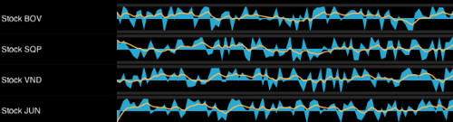

////

|metadata|
{
    "name": "igsparklineview",
    "tags": ["Charting","Getting Started"],
    "controlName": ["IGSparklineView"],
    "guid": "5dbdc8b5-996e-43ac-9cd9-a32ac0cd36af",  
    "buildFlags": [],
    "createdOn": "2013-08-26T18:22:53.7566263Z"
}
|metadata|
////

= IGSparklineView

This section gives you an overview of the use of the  _IGSparklineView_™ control. It contains information ranging from what the control does to the step-by-step procedures on how to accomplish common tasks using the control.

Click the links below to access important information about the  _IGSparklineView_   control.

== About IGSparklineView

The  _IGSparklineView_   is a lightweight charting control that can render the following chart types:

* Line
* Area
* Column
* Win/Loss

The  _IGSparklineView_   is intended for rendering in a small scale layout such as a grid Cell. It can also be rendered stand alone.

== link:igchartview-adding-the-chart-framework-file.html[Adding the Chart Framework File]

This topic demonstrates how to add the Chart framework file to a project.

== link:igsparklineview-adding-sparkline-chart-view.html[Adding a Sparkline Chart to a View]

This topic provides basic information about creating an instance of the  _IGSparklineView_   to help you get up and running with this control.

== link:igsparklineview-display-types.html[Display Types]

This topic explains and details how to define the  _IGSparklineView_   type.

== link:igsparklineview-data-source-helper.html[Data Source Helper]

This topic provides an introductory overview of data source helper in the  _IGSparklineView_   and using a code example demonstrates how to configure it.

== link:igsparklineview-markers.html[Markers]

This topic provides an introductory overview of displaying markers on the  _IGSparklineView_   control.

== link:igsparklineview-themes.html[Themes]

This topic provides an introductory overview of the supported themes available in the  _IGSparklineView_   control.

== link:igsparklineview-trend-lines.html[Trend Lines]

This topic provides an introductory overview of displaying trend lines on the  _IGSparklineView_   control.