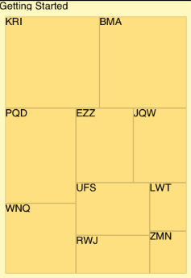

////

|metadata|
{
    "name": "igtreemapview-adding-treemap-view",
    "tags": ["Charting","Getting Started","How Do I"],
    "controlName": ["IGTreemapView"],
    "guid": "85e9f9a2-16a5-40e4-a7ab-734cf50cc813",  
    "buildFlags": [],
    "createdOn": "2013-09-25T12:45:02.0537434Z"
}
|metadata|
////

= Adding the Treemap to a View

== Topic Overview

=== Purpose

To help you get up and running with the  _IGTreemapView_™ control this topic provides basic information about creating an instance of the control for displaying a tree map.

=== Required background

The following table lists the prerequisite topic required to understanding this topic.

[options="header", cols="a,a"]
|====
|Topic|Purpose

| link:igchartview-adding-the-chart-framework-file.html[Adding the Chart Framework File]
|This topic explains how to add the chart framework file to a project.

|====

=== In this topic

This topic contains the following sections:

* <<OLE_LINK49, Code Examples >>
* <<_Ref328621638, Displaying a tree map with IGTreemapView – Code Example >>

** <<_Ref323199287,Description>>
** <<_Ref323199293,Code>>
** <<_Ref323214731,Code: Complete Listing>>

* <<_Ref323199323, Related Content >>

[[_Ref323111244]]
== Code Examples

=== Code examples summary

The code example included in this topic.

[options="header", cols="a,a"]
|====
|Example|Description

|<<_Ref323199279,Displaying a pie chart with _IGTreemapView_ >>
|The starting point to using the _IGTreemapView_ is creating an instance of it and adding it to your view. The code in this example overrides the `viewDidLoad` method on a _UIViewController_ to create the _IGTreemapView_ instance.

|====

[[_Ref323199279]]
[[_Ref328621638]]
== Displaying a tree map with  _IGTreemapView_   – Code Example

[[_Ref323199287]]

=== Description

The provided data source powers the  _IGTreemapView_   data visualization. In this code example, you will:

* Generate a data source
* Assign your data source to the  _IGTreemapView_  , and
* View the displayed tree map.

=== Preview

The following screen shot illustrates a typical  _IGTreemapView_   preview.

[[_Ref323199293]]

=== Code

First, create an instance of the  _IGTreemapView_   with the dimensions of the view controller’s bounds and add it to the view.

*In Objective-C:*

[source,csharp]
----
_treemapView = [[IGTreemapView alloc]initWithFrame:self.view.bounds];
_treemapView.autoresizingMask = UIViewAutoresizingFlexibleHeight|UIViewAutoresizingFlexibleWidth;
[self.view addSubview:_treemapView];
----

*In C#:*

[source,csharp]
----
_treemapView = new IGTreemapView ();
_treemapView.Frame = this.View.Bounds;
_treemapView.AutoresizingMask = UIViewAutoresizing.FlexibleHeight | UIViewAutoresizing.FlexibleWidth;
this.View.Add (_treemapView);
----

Instantiates an NSMutableArray that calls the `createData` method to fill the array.

*In Objective-C:*

[source,csharp]
----
_data = [[NSMutableArray alloc] init];
[self createData];
----

*In C#:*

[source,csharp]
----
_data = new NSMutableArray();
createData ();
----

The data source for this example uses an  _NSMutableArray_   _,_   which creates a specific number of tree map data items that use a custom  _NSObject_   containing a float value, label string and children  _NSMutableArray_  .

*In Objective-C:*

[source,csharp]
----
-(void)createData
{
    for (int j = 0; j < 10; j++)
    {
        TreemapData *dataItem = [[TreemapData alloc] init];
        dataItem.value = arc4random_uniform(1000);
        dataItem.label = [NSString stringWithFormat:@"%c%c%c",
                        arc4random_uniform(26)+65,
                        arc4random_uniform(26)+65,
                        arc4random_uniform(26)+65];
        [_data addObject:dataItem];
    }
}
----

*In C#:*

[source,csharp]
----
void createData()
{
      for (int j = 0; j < 10; j++)
      {
            TreemapData dataItem = new TreemapData();
            dataItem.Value = new Random(j).Next(1000);
            dataItem.Label = String.Format ("{0}{1}{2}", 
                                           Convert.ToChar(new Random ().Next (26) + 65),
                                            Convert.ToChar(new Random ().Next (26) + 65),
                                            Convert.ToChar(new Random ().Next (26) + 65));
            _data.Add (dataItem);
      }
}
----

Create an instance of the  _IGTreemapViewDataSourceHelper_   using the  _NSMutableArray_   that contains our tree map data and a reference of the  _IGTreemapView_  .

*In Objective-C:*

[source,csharp]
----
_treemapViewDataSourceHelper = [[IGTreemapViewDataSourceHelper alloc]initWithData:_data treemapView:_treemapView];
----

*In C#:*

[source,csharp]
----
_treemapViewDataSourceHelper = new IGTreemapViewDataSourceHelper (_data, _treemapView);
----

Add a level to the  _IGTreemapViewDataSourceHelper_   to provide value, label, and children paths from our custom tree map data object. Although, for this example, the children path is left nil.

*In Objective-C:*

[source,csharp]
----
 [_treemapViewDataSourceHelper addLevelWithValuePath:@"value" labelPath:@"label" childSourcePath:nil];
----

*In C#:*

[source,csharp]
----
_treemapViewDataSourceHelper.AddLevel ("Value", "Label", String.Empty);
----

Finally, add the  _IGTreemapViewDataSourceHelper_   reference to the `dataSource` property of the  _IGTreemapView_  .

*In Objective-C:*

[source,csharp]
----
_treemapView.dataSource = _treemapViewDataSourceHelper;
----

*In C#:*

[source,csharp]
----
_treemapView.DataSource = _treemapViewDataSourceHelper;
----

[[_Ref323214731]]

=== Code: Complete Listing

*In Objectve-C:*

[source,csharp]
----
@interface TreemapData : NSObject
@property (nonatomic) CGFloat value;
@property (nonatomic, copy) NSString *label;
@property (nonatomic, retain) NSMutableArray *children;
@end
@implementation TreemapData
@end
@interface igViewController ()
{
    IGTreemapView *_treemapView;
    NSMutableArray *_data;
    IGTreemapViewDataSourceHelper *_treemapViewDataSourceHelper;
}
@end
@implementation igViewController
- (void)viewDidLoad
{
    [super viewDidLoad];
    _treemapView = [[IGTreemapView alloc]initWithFrame:self.view.bounds];
    _treemapView.autoresizingMask = UIViewAutoresizingFlexibleHeight|UIViewAutoresizingFlexibleWidth;
    [self.view addSubview:_treemapView];
    _data = [[NSMutableArray alloc] init];
    [self createData];
    _treemapViewDataSourceHelper = [[IGTreemapViewDataSourceHelper alloc]initWithData:_data treemapView:_treemapView];
    [_treemapViewDataSourceHelper addLevelWithValuePath:@"value" labelPath:@"label" childSourcePath:nil];
    _treemapView.dataSource = _treemapViewDataSourceHelper;
    _treemapView.rootNode.label = @"Getting Started";
}
-(void)createData
{
    for (int j = 0; j < 10; j++)
    {
        TreemapData *dataItem = [[TreemapData alloc] init];
        dataItem.value = arc4random_uniform(1000);
        dataItem.label = [NSString stringWithFormat:@"%c%c%c",
                        arc4random_uniform(26)+65,
                        arc4random_uniform(26)+65,
                        arc4random_uniform(26)+65];
        [_data addObject:dataItem];
    }
}
@end
----

*In C#:*

[source,csharp]
----
public class TreemapData : NSObject
{
      [Export("Value")]
      public float Value { get; set; }
      [Export("Label")]
      public string Label { get; set; }
      [Export("Children")]
      public NSMutableArray Children { get; set; }
}
public partial class TreemapGettingStarted_CSViewController : UIViewController
{
      IGTreemapView _treemapView;
      NSMutableArray _data;
      IGTreemapViewDataSourceHelper _treemapViewDataSourceHelper;
      public TreemapGettingStarted_CSViewController () {}
      public override void ViewDidLoad ()
      {
            base.ViewDidLoad ();
            _treemapView = new IGTreemapView ();
            _treemapView.Frame = this.View.Bounds;
            _treemapView.AutoresizingMask = UIViewAutoresizing.FlexibleHeight | UIViewAutoresizing.FlexibleWidth;
            this.View.Add (_treemapView);
            _data = new NSMutableArray();
            createData ();
            _treemapViewDataSourceHelper = new IGTreemapViewDataSourceHelper (_data, _treemapView);
            _treemapViewDataSourceHelper.AddLevel ("Value", "Label", String.Empty);
            _treemapView.DataSource = _treemapViewDataSourceHelper;
            _treemapView.RootNode.Label = "Getting Started";
      }
      void createData()
      {
            for (int j = 0; j < 10; j++)
            {
                  TreemapData dataItem = new TreemapData();
                  dataItem.Value = new Random(j).Next(1000);
                  dataItem.Label = String.Format ("{0}{1}{2}", 
                                                 Convert.ToChar(new Random ().Next (26) + 65),
                                                  Convert.ToChar(new Random ().Next (26) + 65),
                                                  Convert.ToChar(new Random ().Next (26) + 65));
                  _data.Add (dataItem);
            }
      }
}
----

[[_Ref323199323]]
== Related Content

=== Topics

The following topics provide additional information related to this topic.

[options="header", cols="a,a"]
|====
|Topic|Purpose

| link:igtreemapview.html[IGTreemapView]
|This section serves as an introduction to the _IGTreemapView’s_ key features and functions.

|====