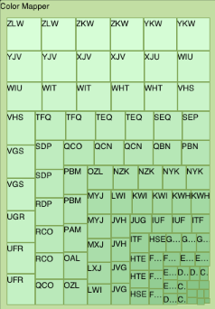

////

|metadata|
{
    "name": "igtreemapview-configuring-color-mapper",
    "tags": ["Charting","Getting Started","How Do I","Styling"],
    "controlName": ["IGTreemapView"],
    "guid": "7627b6b2-08cc-45ac-91e1-3a738a4a12ba",  
    "buildFlags": [],
    "createdOn": "2013-09-25T12:51:08.7887434Z"
}
|metadata|
////

= Configuring the Color Mapper

== Topic Overview

=== Purpose

This topic provides an introductory overview of configuring the color mapper on the  _IGTreemapView_™ control and demonstrates its configuration using a code example.

=== In this topic

This topic contains the following sections:

* <<_Ref324841248, Introduction >>
* <<_Ref327936206, Color Mapping on the IGTreemapView – Code Example >>

** <<_Ref327344209,Description>>
** <<_Ref327523606,Prerequisites>>
** <<_Ref327344217,Code>>
** <<_Ref239999159,Code: Complete Listing>>

* <<_Ref215823716, Related Content >>

[[_Ref324841248]]
== Introduction

[[_Ref215796828]]

=== Color mapper summary

The  _IGTreemapNodeColorMapper_   uses auto calculated or manually set `minimum` and `maximum` values to map the `from` and `to` brush color range across the tree map leaf nodes based on their `propertyPath` value.

Illustrated below is the  _IGTreemapView_   using the color mapper.

[[_Ref324842387]]
[[_Ref327936206]]
[[_Ref324841253]]
== Color Mapping on the  _IGTreemapView_  – Code Example

[[_Ref327344209]]

=== Description

The following code creates a color mapper with the minimum and maximum value range of 0 to 1000 and maps out varied green hues based on the `propertyPath` value.

[[_Ref327523606]]

=== Prerequisites

This code example requires the inclusion of the  _Chart_   framework, detail about how to add this framework can be found in the link:igchartview-adding-the-chart-framework-file.html[Adding the Chart Framework File] topic.

[[_Ref327344217]]

=== Code

*In C#:*

[source,csharp]
----
IGTreemapView treemapView = new IGTreemapView();
//Configure the tree map
IGTreemapNodeColorMapper colorMapper = new IGTreemapNodeColorMapper ();
colorMapper.Minimum = 0;
colorMapper.Maximum = 1000;
colorMapper.From = new IGBrush (0.5f, 0.75f, 0.5f, 1.0f);
colorMapper.To = new IGBrush (0.85f, 1.0f, 0.85f, 1.0f);
colorMapper.PropertyPath = @"Value";
treemapView.ColorMapper = colorMapper;
----

*In Objective-C:*

[source,csharp]
----
IGTreemapView *treemapView = [[IGTreemapView alloc] init];
//Configure the tree map
IGTreemapNodeColorMapper *colorMapper = [[IGTreemapNodeColorMapper alloc] init];
colorMapper.minimum = 0;
colorMapper.maximum = 1000;
colorMapper.from = [[IGBrush alloc] initWithR:0.5 andG:0.75 andB:0.5 andA:1.0];
colorMapper.to = [[IGBrush alloc] initWithR:0.85 andG:1.0 andB:0.85 andA:1.0];
colorMapper.propertyPath = @"value";
treemapView.colorMapper = colorMapper;
----

[[_Ref239999159]]

=== Code: Complete Listing

*In C#:*

[source,csharp]
----
public class TreemapData : NSObject
{
      [Export("Value")]
      public float Value { get; set; }
      [Export("Label")]
      public string Label { get; set; }
      [Export("Children")]
      public NSMutableArray Children { get; set; }
}
public partial class TreemapColorMapper_CSViewController : UIViewController
{
      IGTreemapView _treemapView;
      NSMutableArray _data;
      IGTreemapViewDataSourceHelper _treemapViewDataSourceHelper;
      IGTreemapNodeColorMapper _colorMapper;
      public TreemapColorMapper_CSViewController () {}
      public override void ViewDidLoad ()
      {
            base.ViewDidLoad ();
            _treemapView = new IGTreemapView ();
            _treemapView.Frame = this.View.Bounds;
            _treemapView.AutoresizingMask = UIViewAutoresizing.FlexibleHeight | UIViewAutoresizing.FlexibleWidth;
            this.View.Add (_treemapView);
            _data = new NSMutableArray();
            createData ();
            _treemapViewDataSourceHelper = new IGTreemapViewDataSourceHelper (_data, _treemapView);
            _treemapViewDataSourceHelper.AddLevel ("Value", "Label", String.Empty);
            _treemapView.DataSource = _treemapViewDataSourceHelper;
            _treemapView.RootNode.Label = "Color Mapper";
            _colorMapper = new IGTreemapNodeColorMapper ();
            _colorMapper.Minimum = 0;
            _colorMapper.Maximum = 1000;
            _colorMapper.From = new IGBrush (0.5f, 0.75f, 0.5f, 1.0f);
            _colorMapper.To = new IGBrush (0.85f, 1.0f, 0.85f, 1.0f);
            _colorMapper.PropertyPath = @"Value";
            _treemapView.ColorMapper = _colorMapper;
      }
      void createData()
      {
            for (int j = 0; j < 100; j++)
            {
                  TreemapData dataItem = new TreemapData();
                  dataItem.Value = new Random(j).Next(1000);
                  dataItem.Label = String.Format ("{0}{1}{2}", 
                                                  Convert.ToChar(new Random (j).Next (26) + 65),
                                                  Convert.ToChar(new Random (j+1).Next (26) + 65),
                                                  Convert.ToChar(new Random (j+2).Next (26) + 65));
                  _data.Add (dataItem);
            }
      }
}
----

*In Objective-C:*

[source,csharp]
----
@interface TreemapData : NSObject
@property (nonatomic) CGFloat value;
@property (nonatomic, copy) NSString *label;
@property (nonatomic, retain) NSMutableArray *children;
@end
@implementation TreemapData
@end
@interface igViewController ()
{
    IGTreemapView *_treemapView;
    NSMutableArray *_data;
    IGTreemapViewDataSourceHelper *_treemapViewDataSourceHelper;
    IGTreemapNodeColorMapper *_colorMapper;
}
@end
@implementation igViewController
- (void)viewDidLoad
{
    [super viewDidLoad];
    _treemapView = [[IGTreemapView alloc]initWithFrame:self.view.bounds];
    _treemapView.autoresizingMask = UIViewAutoresizingFlexibleHeight|UIViewAutoresizingFlexibleWidth;
    [self.view addSubview:_treemapView];
    _data = [[NSMutableArray alloc] init];
    [self createData];
    _treemapViewDataSourceHelper = [[IGTreemapViewDataSourceHelper alloc]initWithData:_data treemapView:_treemapView];
    [_treemapViewDataSourceHelper addLevelWithValuePath:@"value" labelPath:@"label" childSourcePath:nil];
    _treemapView.dataSource = _treemapViewDataSourceHelper;
    _treemapView.rootNode.label = @"Color Mapper";
    _colorMapper = [[IGTreemapNodeColorMapper alloc] init];
    _colorMapper.minimum = 0;
    _colorMapper.maximum = 1000;
    _colorMapper.from = [[IGBrush alloc] initWithR:0.5 andG:0.75 andB:0.5 andA:1.0];
    _colorMapper.to = [[IGBrush alloc] initWithR:0.85 andG:1.0 andB:0.85 andA:1.0];
    _colorMapper.propertyPath = @"value";
    _treemapView.colorMapper = _colorMapper;
}
-(void)createData
{
    for (int j = 0; j < 100; j++)
    {
        TreemapData *dataItem = [[TreemapData alloc] init];
        dataItem.value = arc4random_uniform(1000);
        dataItem.label = [NSString stringWithFormat:@"%c%c%c",
                                                    arc4random_uniform(26)+65,
                                                    arc4random_uniform(26)+65,
                                                    arc4random_uniform(26)+65];
        [_data addObject:dataItem];
    }
}
@end
----

[[_Ref215823716]]
== Related Content

=== Topics

The following topic provides additional information related to this topic.

[options="header", cols="a,a"]
|====
|Topic|Purpose

| link:igtreemapview-configuring-igtreemapview.html[Configuring IGTreemapView]
|The topics in this group cover enabling, configuring, and using the _IGTreemapView_ control’s supported features.

|====