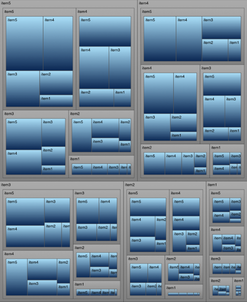

////

|metadata|
{
    "name": "igtreemapview",
    "tags": ["Charting","Getting Started"],
    "controlName": ["IGTreemapView"],
    "guid": "2f734178-f9ed-495f-b79d-970c60336749",  
    "buildFlags": [],
    "createdOn": "2013-09-25T12:42:53.5537434Z"
}
|metadata|
////

= IGTreemapView

This section gives you an overview of the use of the  _IGTreemapView_™ control. It contains information ranging from what the control does to the step-by-step procedures on how to accomplish common tasks using the control.

Click the links below to access important information about the  _IGTreemapView_   control.

== About IGTreemapView

_IGTreemapView_   is designed to display a hierarchical data structure of treemap nodes, where each node is represented by a rectangle. Each treemap node can have any number of child nodes and the children are sorted by size, from largest to smallest.

A typical data source for the treemap is an array of custom objects, each of which can potentially hold an array of custom objects. A treemap datasource must conform to  _IGTreemapViewDataSource_   protocol.  _IGTreemapViewDataSourceHelper_   provides a way to easily create a valid datasource by supplying the property paths for the nodes to bind to at each level of the treemap.

There are several layout algorithms that define the layout of the treemap nodes. Those are controlled by `layoutOrientation` and `layoutType` properties.

The treemap supports themes. There are predefined themes available in IGTreemapThemes.h. Custom themes can be created by implementing  _IGTreemapThemeDefinition_   protocol. Theme colors are applied per level in the treemap. The same effect can be achieved by assigning an array of brushes and outlines via brushes and outlines properties. Treemap nodes can also get their brushes from a color mapper.  _IGTreemapNodeColorMapper_   can be used to conditionally set node brushes based on the node's size or based on any other property value in the data source.

The treemap supports transitional animations via `transitionDuration` property. Nodes will animate their frame changes when layout changes or during drill-down and drill-back operations. Drill-down and drill-back are built into the treemap and will be triggered by tapping on a node and pinching in respectively. These triggers can be overridden by implementing the treemap delegate.

The tremap has two rendering modes:  _UIView_   (default) and immediate mode. By default each node will be treated as a child  _UIView_   or its parent node. This makes the node support any operations available in a  _UIView_  , such as custom content. During immediate mode rendering, all nodes are drawn using core graphics, which makes the treemap perform faster at the cost of flexibility of using views.

== link:igchartview-adding-the-chart-framework-file.html[Adding the Chart Framework File]

This topic demonstrates how to add the Chart framework file to a project.

== link:igtreemapview-adding-treemap-view.html[Adding the Treemap to a View]

This topic provides basic information about creating an instance of the  _IGTreemapView_   to help you get up and running with this control.

== link:igtreemapview-configuring-igtreemapview.html[Configuring IGTreemapView]

The topics in this group explain and demonstrate enabling, configuring, and using the  _IGTreemapView_   control’s supported features.

== link:igtreemapview-data-source-helper.html[Data Source Helper]

This topic provides a conceptual overview of the data source helper in the  _IGTreemapView_   and demonstrates its configuration using a code example.

== link:igtreemapview-layouts.html[Layouts]

This topic provides an introductory overview of the supported tree map layouts available in the  _IGTreemapView_   control.

== link:igtreemapview-themes.html[Themes]

This topic provides an introductory overview of the supported themes available in the  _IGTreemapView_   control.