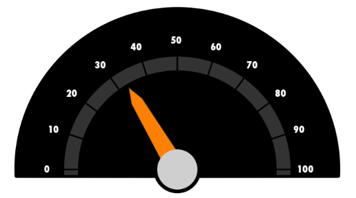
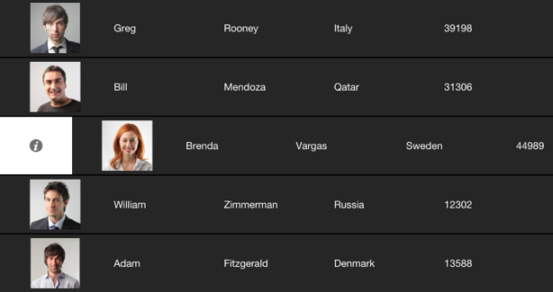
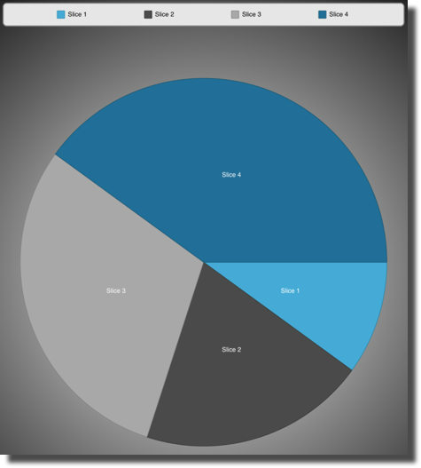

////

|metadata|
{
    "name": "whats-new-2013-1",
    "controlName": [],
    "tags": ["Getting Started"],
    "guid": "0c0fbef7-d40a-4319-9313-a490c4f21135",  
    "buildFlags": [],
    "createdOn": "2013-02-13T14:34:33.1277524Z"
}
|metadata|
////

= 2013 Volume 1

== New Features Summary

=== New features summary chart

The following table summarizes the new features of the NucliOS 2013 Volume 1. Additional details are available following the summary table.

[options="header", cols="a,a,a"]
|====
|Control|Feature|Description

|<<_Ref223405955,IGChartView>>
|<<_Ref223405989,Chart Types>>
|New Chart Types Added: 

* Financial Indicators: Bollinger Band Overlay, Bollinger Band Width, Chaikin Oscillator, Chaikin Volatility, Commodity Channel Index, Detrended Price Oscillator, Ease of Movement, Fast Stochastic Oscillator, Force Index, Full Stochastic Oscillator, Market Facilitation Index, Mass Index, Median Price, Money Flow Index, Moving Average Convergence Divergence, Negative Volume Index, On Balance Volume, Percentage Price Oscillator, Percentage Volume Oscillator, Positive Volume Index, Price Channel Overlay, Rate of Change and Momentum, Relative Strength Index, Slow Stochastic Oscillator, Standard Deviation, StochRSI, TRIX, Ultimate Oscillator, Weighted Close, Williams Percent Range 

* Category Series: Stacked 100 Area, Stacked 100 Bar, Stacked 100 Column, Stacked 100 Line, Stacked 100 Spline Area, Stacked 100 Spline, Stacked Area, Stacked Bar, Stacked Column, Stacked Line, Stacked Spline Area, Stacked Spline 

* Polar Series: Polar Spline, Polar Spline Area 

* Radial Series: Radial Area 

* Scatter Series: Scatter Line, Scatter Spline 

* Value Overlay 

|
|<<_Ref223406018,Gradient Brush and Themes>>
|An _IGGradientBrush_, which inherits from _IGBrush_ along with several new gradient themes were added for the 2013 Volume 1 release.

|<<_Ref350151877,IGGaugeView>>
|<<_Ref350151885,New Control>>
|The new _IGGaugeView_ control offers a simple to use API for visualizing a numerical value through a highly customizable radial gauge.

|<<_Ref223421047,IGGridView>>
|<<_Ref223421074,Column Reordering>>
|The new column-reordering feature allows users to rearrange the position of visible columns within their data source helper, except for cell specific helpers, by using simple drag and drop techniques.

|
|<<_Ref223421103,Column Resizing>>
|Columns can now be resized through the UI by setting a single property.

|
|<<_Ref223421126,Filter Highlighting (iOS 6+)>>
|The new filter attributes allow you to apply a customized visual appearance to text matching a filtered text string.

|
|<<_Ref223421148,Fixed Columns>>
|Fixed columns have been added to the _IGGridView_ allowing a column to stay in view on either the left or right side of the _IGGridView_, while allowing horizontal scrolling of the other columns.

|
|<<_Ref223421164,Grid Theming>>
|Grid theming support introduced with 2013 Volume 1 allowing you to apply a consistent, color coordinated, look and feel to your charts. In addition to 2 preset themes.

|
|<<_Ref223421178,Infinite Scrolling>>
|The new feature, infinite scrolling, allows the grid to scroll the contents of the _IGGridView_ continuously, without the need to scroll back to the top or left most cell.

|
|<<_Ref223421194,Swipe Row>>
|Newly added swipe row functionality allows a user to swipe their finger on a row and have the row slide in a specific direction, exposing a _UIView_ on the left or right side of the row.

|<<_Ref223579032,IGLabel>>
|<<_Ref223579049,New Control>>
|The new _IGLabel_ control is a rich text label that works similarly to the generic _UILabel_ and applies styles to text, done in a similar fashion as using attributed strings.

|<<_Ref223579065,IGPieChartView>>
|<<_Ref223579078,New Control>>
|The new _IGPieChartView_ control is a data visualization tool that displays a circular graph containing sectors (slices). Pie chart data is a collection of numeric values, and each slice represents one value.

|<<_Ref223579092,Xamarin.iOS (formerly MonoTouch)>>
|<<_Ref223579111,Bindings and API Documentation>>
|NucliOS 2013 Volume 1 is the first full release of our Xamarin.iOS (formerly MonoTouch) bindings!

|====

[[_Ref223405955]]
== IGChartView

[[_Ref223405989]]

=== Chart Types

NucliOS 2013 Volume 1 release added several new chart types.

* Financial Indicators: link:igchartview-bollinger-band-overlay.html[Bollinger Band Overlay], link:igchartview-bollinger-band-width-indicator.html[Bollinger Band Width Indicator], link:igchartview-chaikin-oscillator-indicator.html[Chaikin Oscillator Indicator], link:igchartview-chaikin-volatility-indicator.html[Chaikin Volatility Indicator], link:igchartview-commodity-channel-index-indicator.html[Commodity Channel Index Indicator], link:igchartview-detrended-price-oscillator-indicator.html[Detrended Price Oscillator Indicator], link:igchartview-ease-of-movement-indicator.html[Ease Of Movement Indicator], link:igchartview-fast-stochastic-oscillator-indicator.html[Fast Stochastic Oscillator Indicator], link:igchartview-force-index-indicator.html[Force Index Indicator], link:igchartview-full-stochastic-oscillator-indicator.html[Full Stochastic Oscillator Indicator], link:igchartview-market-facilitation-index-indicator.html[Market Facilitation Index Indicator], link:igchartview-mass-index-indicator.html[Mass Index Indicator], link:igchartview-median-price-indicator.html[Median Price Indicator], link:igchartview-money-flow-index-indicator.html[Money Flow Index Indicator], link:igchartview-moving-average-convergence-divergence-indicator.html[Moving Average Convergence Divergence Indicator], link:igchartview-negative-volume-index-indicator.html[Negative Volume Index Indicator], link:igchartview-on-balance-volume-indicator.html[On Balance Volume Indicator], link:igchartview-percentage-price-oscillator-indicator.html[Percentage Price Oscillator Indicator], link:igchartview-percentage-volume-oscillator-indicator.html[Percentage Volume Oscillator Indicator], link:igchartview-positive-volume-index-indicator.html[Positive Volume Index Indicator], link:igchartview-price-channel-overlay.html[Price Channel Overlay], link:igchartview-rate-change-momentum-indicator.html[Rate of Change and Momentum Indicator], link:igchartview-relative-strength-index-indicator.html[Relative Strength Index Indicator], link:igchartview-slow-stochastic-oscillator-indicator.html[Slow Stochastic Oscillator Indicator], link:igchartview-standard-deviation-indicator.html[Standard Deviation Indicator], link:igchartview-stochrsi-indicator.html[StochRSI Indicator], link:igchartview-trix-indicator.html[TRIX Indicator], link:igchartview-ultimate-oscillator-indicator.html[Ultimate Oscillator Indicator], link:igchartview-weighted-close-indicator.html[Weighted Close Indicator], link:igchartview-williams-percent-range-indicator.html[Williams Percent Range Indicator]
* Category Series: link:igchartview-stacked-100-area-series.html[Stacked 100 Area Series], link:igchartview-stacked-100-bar-series.html[Stacked 100 Bar Series], link:igchartview-stacked-100-column-series.html[Stacked 100 Column Series], link:igchartview-stacked-100-line-series.html[Stacked 100 Line Series], link:igchartview-stacked-100-spline-area-series.html[Stacked 100 Spline Area Series], link:igchartview-stacked-100-spline-series.html[Stacked 100 Spline Series], link:igchartview-stacked-area-series.html[Stacked Area Series], link:igchartview-stacked-bar-series.html[Stacked Bar Series], link:igchartview-stacked-column-series.html[Stacked Column Series], link:igchartview-stacked-line-series.html[Stacked Line Series], link:igchartview-stacked-spline-area-series.html[Stacked Spline Area Series], link:igchartview-stacked-spline-series.html[Stacked Spline Series]
* Polar Series: link:igchartview-polar-spline-series.html[Polar Spline Series], link:igchartview-polar-spline-area-series.html[Polar Spline Area Series]
* Radial Series: link:igchartview-radial-area-series.html[Radial Area Series]
* Scatter Series: link:igchartview-scatter-line-series.html[Scatter Line Series], link:igchartview-scatter-spline-series.html[Scatter Spline Series]
* link:igchartview-value-overlay.html[Value Overlay]

==== Related Topic:

* link:igchartview-chart-series.html[Chart Series]

[[_Ref223406018]]

=== Gradient Brush and Themes

An  _IGGradientBrush_  , which inherits from  _IGBrush,_   and several new gradient themes were added for the 2013 Volume 1 release.

* IGTheme
* IGThemeDark
* FinanceTheme1
* FinanceTheme2
* FinanceTheme3
* FinanceTheme4
* FinanceTheme5

==== Related Topic:

* link:igchartview-themes.html[Themes]

[[_Ref350151877]]
== IGGaugeView

[[_Ref346271639]]

=== New Control

The new  _IGGaugeView_   control offers a simple to use API for visualizing a numerical value through a highly customizable radial gauge.

==== Related Topics:

* link:iggaugeview.html[IGGaugeView]

[[_Ref223421047]]
== IGGridView

[[_Ref223421074]]

=== Column Reordering

The new column-reordering feature allows users to rearrange the position of visible columns within their data source helper, except for cell specific helpers, by using simple drag and drop techniques.

==== Related Topics:

* link:iggridview-column-reordering.html[Column Reordering]

[[_Ref223421103]]

=== Column Resizing

Columns can now be resized through the UI by setting a single property.

==== Related Topics:

* link:iggridview-configuring-ui-column-resizing.html[Configuring UI Column Resizing]

[[_Ref223421126]]

=== Filter Highlighting (iOS 6+)

The new filter attributes allow you to apply a customized visual appearance to text matching a filtered text string.

==== Related Topics:

* link:iggridview-filtering-attributes.html[Filtering Attributes]

[[_Ref223421148]]

=== Fixed Columns

Fixed columns have been added to the  _IGGridView_   that allow a column to stay in view on either the left or right side of the  _IGGridView_   while allowing horizontal scrolling of the other columns.

==== Related Topics:

* link:iggridview-fixed-columns.html[Fixed Columns]

[[_Ref223421164]]

=== Grid Theming

New Grid theming support and preset themes are included with 2013 Volume 1 allowing you to apply a consistent, color coordinated, look and feel to your charts.

==== Related Topics:

* link:iggridview-themes.html[Themes]

[[_Ref223421178]]

=== Infinite Scrolling

This new feature, infinite scrolling allows the grid to scroll the contents of the  _IGGridView_   continuously, without the need to scroll back to the top or left most cell.

==== Related Topics:

* link:iggridview-enabling-infinite-scrolling.html[Enabling Infinite Scrolling]

[[_Ref223421194]]

=== Swipe Row

Newly added swipe row functionality allows users to swipe their finger on a row and have the row slide in a specific direction, exposing a  _UIView_   on either the left or right side of the row.

==== Related Topics:

* link:iggridview-configuring-swipe-row.html[Configuring Swipe Row]

[[_Ref223579032]]
== IGLabel

[[_Ref223579049]]

=== New Control

The new  _IGLabel_   control is a rich text label that works similarly to the generic  _UILabel_   and applies styles to text in a similar fashion that is done when using attributed strings. Based on Core Text to boost performance and functionality over the generic  _UILabel_  .

==== Related Topic:

* link:iglabel.html[IGLabel]

[[_Ref223579065]]
== IGPieChartView

[[_Ref223579078]]

The new  _IGPieChartView_   control is a data visualization tool that displays a circular graph containing sectors (slices). Pie chart data is a collection of numeric values, and each slice represents one value. The  _IGPieChartView_   supports multiple slice selection and explosion, as well as tooltips, rotation, tap and long press gestures.

==== Related Topics:

* link:igpiechartview.html[IGPieChartView]

[[_Ref223579092]]
== Xamarin.iOS (formerly MonoTouch)

[[_Ref223579111]]

=== Bindings and API Documentation

NucliOS 2013 Volume 1 is the first full release of our Xamarin.iOS (formerly MonoTouch) bindings! This includes full API documentation, updated tutorial documents, and updated APIs that are much more C# friendly.