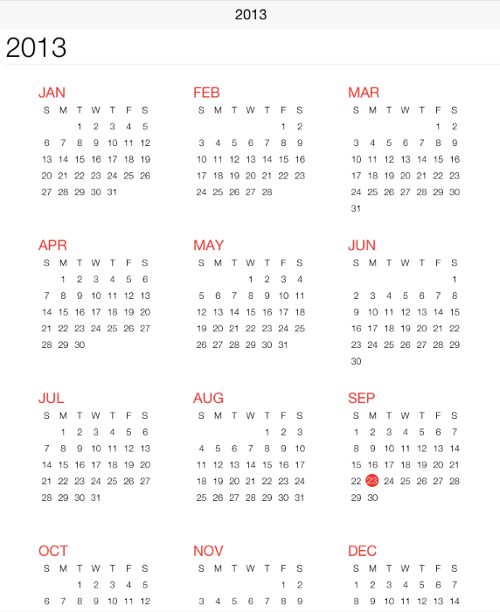
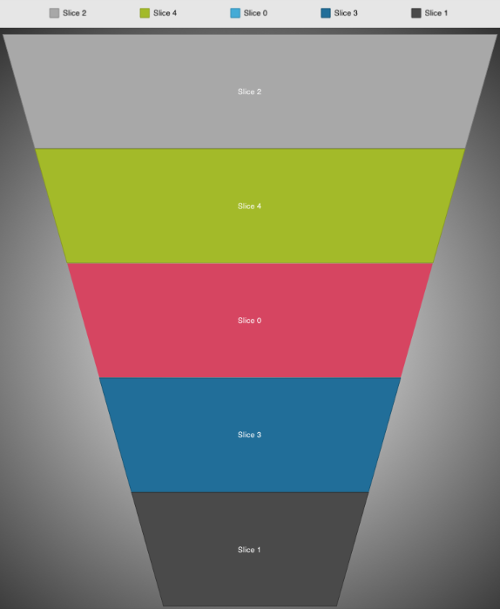

////

|metadata|
{
    "name": "whats-new-2013-2",
    "controlName": [],
    "tags": [],
    "guid": "a8e97c31-e31b-44f4-a5a2-4acf25092108",  
    "buildFlags": [],
    "createdOn": "2013-08-29T12:50:11.0031938Z"
}
|metadata|
////

= 2013 Volume 2

== New Features Summary

=== New features summary chart

The following table summarizes the new features of the NucliOS 2013 Volume 2. Additional details are available following the summary table.

[options="header", cols="a,a,a"]
|====
|Control|Feature|Description

|<<_Ref241555740,IGBulletGraphView>>
|<<_Ref241555853,New Control>>
|The new _IGBulletGraphView_ control is a simple single column/bar graph used to display data in a simple manner.

|<<_Ref241555748,IGCalendarView>>
|<<_Ref241555861,New Control>>
|The new _IGCalendarView_ control displays different views for navigating dates and display appointments. Within in this control you can view 3 different display types: 

* Year 

* Month 

* Day 

|<<_Ref241555754,IGChartView>>
|<<_Ref241555869,Custom Markers>>
|Custom markers are being introduced with 2013 Volume 2, allowing you to insert a _UIView_ in place of a marker on a data point.

|
|<<_Ref241555881,Rounded Corners>>
|The ability to configure the roundness of corners of various series is being added to our 2013 Volume 2 release. You can configure rounded corners on the following series: 

* _IGBarSeries_ 

* _IGColumnSeries_ 

* _IGRadialColumnSeries_ 

* _IGRadialPieSeries_ 

* _IGRangeColumnSeries_ 

* _IGStacked100BarSeries_ 

* _IGStackedBarSeries_ 

* _IGStacked100ColumnSeries_ 

* _IGStackedColumnSeries_ 

* _IGWaterfallSeries_ 

|
|<<_Ref241555891,Single Axis Zoom>>
|Single axis zoom is being introduced in 2013 Volume 2, allowing the _IGChartView_ to restrict its zooming along either the vertical or horizontal axis.

|<<_Ref241555769,IGFunnelChartView>>
|<<_Ref241555900,New Control>>
|The new _IGFunnelChartView_ is a data visualization tool that displays funnel slices with progressively increasing or decreasing values. The shape of the funnel chart most often resembles an upside-down trapezoid.

|<<_Ref223421047,IGGridView>>
|<<_Ref241555909,Grid Data Entry>>
|Data entry support is being introduced with 2013 Volume 2 allowing you to place a grid cell into a mode that makes it editable.

|
|<<_Ref223421194,Swipe Row>>
|Swipe row allows a user to swipe their finger on a row and have the row slide in a specific direction, exposing a _UIView_ on the left or right side of the row. This feature was updated for 2013 Volume 2, allowing the user to drag rows or performing percentage dragging.

|<<_Ref241555791,IGLinearGaugeView>>
|<<_Ref223579049,New Control>>
|The new _IGLinearGaugeView_ control offers a simple to use API for visualizing a numerical value through a highly customizable linear gauge.

|<<_Ref241555801,IGOverlayView>>
|<<_Ref223579078,New Control>>
|The new _IGOverlayView_ control is a powerful and extremely flexible control for displaying any type of view that will overlay another view, with or without animation, when shown or dismissed. Included are a total of 12 overlay animations, with 2 of these animation types allowing for custom animations limited only by your imagination.

|<<_Ref241555810,IGProgressView>>
|<<_Ref241555945,New Control>>
|The new _IGProgressView_ control is a multifaceted progress control capable of rendering standard, radial, or even custom progress shapes.

|<<_Ref241555817,IGRangeSelectorView>>
|<<_Ref241555954,New Control>>
|Use the new _IGRangeSelectorView_ control with the _IGChartView_ to control zooming and scrolling when the _IGChartView's_ `zoomDisplayType` is set to horizontal or vertical.

|<<_Ref241555827,IGSparklineView>>
|<<_Ref241555960,New Control>>
|The new _IGSparklineView_ control is a lightweight charting control that can render the following chart types: 

* Line 

* Area 

* Column 

* Win/Loss 

|<<_Ref241555832,IGTreemapView>>
|<<_Ref241555968,New Control>>
|The new _IGTreemapView_ control is a data visualization displaying hierarchical data by using nested rectangles.

|====

[[_Ref241555740]]
== IGBulletGraphView

[[_Ref241555853]]

=== New Control

The new  _IGBulletGraphView_   control is a simple single column/bar graph used to display data in a simple manner.

image::images/What's_New_in_2013_Volume_2_1.png[]

==== Related Topics:

* link:igbulletgraphview.html[IGBulletGraphView]

[[_Ref241555748]]
== IGCalendarView

[[_Ref241555861]]

The new  _IGCalendarView_   control displays different views for navigating dates and display appointments. Within in this control you can view 3 different display types:

* Year
* Month
* Day

==== Related Topics:

* link:igcalendarview.html[IGCalendarView]

[[_Ref241555754]]
== IGChartView

[[_Ref241555869]]

=== Custom Markers

Introducing Custom markers with 2013 Volume 2 allowing you to insert a  _UIView_   in place of a marker on a data point.

*image::images/What's_New_in_2013_Volume_2_3.png[]*

==== Related Topic:

* link:igchartview-using-custom-markers.html[Using Custom Markers]

[[_Ref241555881]]

=== Rounded Corners

Adding the ability to configure the roundness of corners of various series to our 2013 Volume 2 release. You can configure rounded corners can on the following series:

*  _IGBarSeries_  
*  _IGColumnSeries_  
*  _IGRadialColumnSeries_  
*  _IGRadialPieSeries_  
*  _IGRangeColumnSeries_  
*  _IGStacked100BarSeries_  
*  _IGStackedBarSeries_  
*  _IGStacked100ColumnSeries_  
*  _IGStackedColumnSeries_  
*  _IGWaterfallSeries_  

==== Related Topic:

* link:igchartview-configuring-rounded-corners.html[Configuring Rounded Corners]

[[_Ref241555891]]

=== Single Axis Zoom

Introducing single axis zoom in 2013 Volume 2, allowing the  _IGChartView_   to restrict its zooming along either the vertical or horizontal axis.

==== Related Topic:

* link:igchartview-configuring-single-axis-zoom.html[Configuring Single Axis Zoom]

[[_Ref241555769]]
== IGFunnelChartView

[[_Ref241555900]]

=== New Control

The new  _IGFunnelChartView_   is a data visualization tool that displays funnel slices with progressively increasing or decreasing values. The shape of the funnel chart most often resembles an upside-down trapezoid.

==== Related Topics:

* link:igfunnelchartview.html[IGFunnelChartView]

[[_Ref223421047]]
== IGGridView

[[_Ref241555909]]

=== Grid Data Entry

Introducing data entry support with 2013 Volume 2 allowing you to place a grid cell into an editable mode.

image::images/What's_New_in_2013_Volume_2_6.png[]

==== Related Topics:

* link:iggridview-configuring-grid-data-entry.html[Configuring Grid Data Entry]

[[_Ref223421194]]

=== Swipe Row

Swipe row allows a user to swipe their finger on a row and have the row slide in a specific direction, exposing a  _UIView_   on the left or right side of the row. Updated this feature for 2013 Volume 2, allowing the user to drag rows or performing percentage dragging.

==== Related Topics:

* link:iggridview-configuring-swipe-row.html[Configuring Swipe Row]

[[_Ref241555791]]
== IGLinearGaugeView

[[_Ref223579049]]

=== New Control

The new  _IGLinearGaugeView_   control offers a simple to use API for visualizing a numerical value through a highly customizable linear gauge.

image::images/What's_New_in_2013_Volume_2_8.png[]

==== Related Topic:

* link:iglineargaugeview.html[IGLinearGaugeView]

[[_Ref241555801]]
== IGOverlayView

[[_Ref223579078]]

The new  _IGOverlayView_   control is a powerful and extremely flexible control for displaying any type of view that will overlay another view, with or without animation, when shown or dismissed. Included are a total of 12 overlay animations, with 2 of these animation types allowing for custom animations limited only by your imagination.

==== Related Topics:

* link:igoverlayview.html[IGOverlayView]

[[_Ref241555810]]
== IGProgressView

[[_Ref241555945]]

The new multifaceted  _IGProgressView_   control is a progress control capable of rendering standard, radial, or even custom progress shapes.

image::images/What's_New_in_2013_Volume_2_10.png[]

==== Related Topic:

* link:igprogressview.html[IGProgressView]

[[_Ref241555817]]
== IGRangeSelectorView

[[_Ref241555954]]

Use the new  _IGRangeSelectorView_   control with the  _IGChartView_   to control zooming and scrolling when the  _IGChartView's_   `zoomDisplayType` is set to horizontal or vertical.

image::images/What's_New_in_2013_Volume_2_11.png[]

==== Related Topic:

* link:igrangeselectorview.html[IGRangeSelectorView]

[[_Ref241555827]]
== IGSparklineView

[[_Ref241555960]]

The new  _IGSparklineView_   control is a lightweight charting control that can render the following chart types:

* Line
* Area
* Column
* Win/Loss

image::images/What's_New_in_2013_Volume_2_12.png[]

==== Related Topic:

* link:igsparklineview.html[IGSparklineView]

[[_Ref241555832]]
== IGTreemapView

[[_Ref241555968]]

The new  _IGTreemapView_   control is a data visualization that displays hierarchical data by using nested rectangles.

image::images/What's_New_in_2013_Volume_2_13.png[]

==== Related Topic:

* link:igtreemapview.html[IGTreemapView]