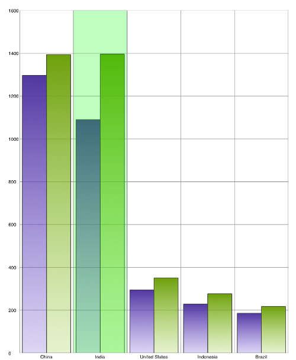
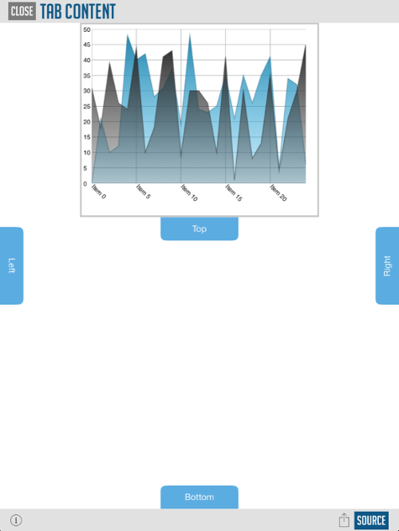

////

|metadata|
{
    "name": "whats-new-2014-1",
    "controlName": [],
    "tags": [],
    "guid": "28f9b703-0d99-4d85-9cdf-d961ca5050aa",  
    "buildFlags": [],
    "createdOn": "2014-03-19T12:36:50.0110167Z"
}
|metadata|
////

= 2014 Volume 1

== New Features Summary

=== New features summary chart

The following table summarizes the new features of the NucliOS 2014 Volume 1. Additional details are available following the summary table.

[options="header", cols="a,a,a"]
|====
|Control|Feature|Description

|<<_Ref256319450, IGBarcodeView >> 
|<<_Ref256319513,New Control>>
|The new _IGBarcodeView_ control can render out 12 different 1D barcode types. 

* Codabar 

* Code 39 

* Code 39 Extended 

* Code 128 

* EAN 8 

* EAN 13 

* Interleaved 2 of 5 

* Planet 

* PostNet 

* Standard 2 of 5 

* UPC-A 

* UPC-E 

|<<_Ref256319458, IGChartView >> 
|<<_Ref256319522,Custom Highlighting>>
|Custom highlighting added in 2014 Volume 1 allows the visual customization the displayed data on the _IGChartView_ . For example, the stroke, fill, opacity, etc.

|
|<<_Ref256319529,Highlighting Layers>>
|Highlighting layers was added to the _IGChartView_ for 2014 Volume 1 to allow for highlighting of data points via interaction with the display. The following are the added highlighting layers. 

* _IGCrosshairLayer_ 

* _IGCategoryItemHighlightLayer_ 

* _IGCategoryHighlightLayer_ 

|
|<<_Ref256319537,Custom Markers>>
|Custom markers support was improved for 2014 Volume 1 to provide options that allow for interactive markers.

|
|<<_Ref256319545,Rounded Corners>>
|The ability to configure the roundness of corners of various series was updated in our 2014 Volume 1 release. The updated functionality allows the selection of which corners to round: top/left, bottom/right or all. Rounded corners can be configured on the following series: 

* _IGBarSeries_ 

* _IGColumnSeries_ 

* _IGRadialColumnSeries_ 

* _IGRadialPieSeries_ 

* _IGRangeColumnSeries_ 

* _IGStacked100BarSeries_ 

* _IGStackedBarSeries_ 

* _IGStacked100ColumnSeries_ 

* _IGStackedColumnSeries_ 

* _IGWaterfallSeries_ 

|
|<<_Ref256319555,Asynchronous Category Data Source>>
|The _IGChartView_ has an additional data source helper added for 2014 Volume 1 that allows charts to load chunks of its data as needed.

|<<_Ref223421047,IGGridView>>
|<<_Ref256319567,Expandable Sections>>
|The _IGGridView_ has added functionality in 2014 Volume 1 to allow the programmatic expansion and collapse of all the rows in a section and also allows the end user, through interaction, to do the same.

|
|<<_Ref256319578,Dynamic Row Height>>
|The _IGGridView_ has added functionality in 2014 Volume 1 that can automatically adjust a row’s height if a cell’s content is longer than the column’s width.

|<<_Ref256319480,IGFlowLayoutView>>
|<<_Ref223579049,New Control>>
|The new _IGFlowLayoutView_ can create a dynamically sized list of items that can be scrolled horizontally or vertically.

|<<_Ref256319489,IGPieChartView>>
|<<_Ref256319665,Exploding Slices>>
|Slice explosion was improved for 2014 Volume 1 to include an additional way to display exploded slices by extending their radius.

|
|<<_Ref256319674,Rotate to Angle>>
|Starting with 2014 Volume 1, pie slices on the _IGPieChartView_ can rotate to a specified angle.

|<<_Ref256319495,IGSlideTabView>>
|<<_Ref256319682,New Control>>
|The new _IGSlideTabView_ allows you to easily create a tab item on any side of the contained view that slides out content when tapped or swiped. Customization options include a property named `useTabPadding` allowing you to add padding around the `contentAreaView` so that your views are not overlapped by tabs, strobing a tab item to draw attention and provide full flexibility to create your own view and content tabs view.

|====

[[_Ref256319450]]
== IGBarcodeView

[[_Ref256319513]]

=== New Control

The new  _IGBarcodeView_   control delivers 12 different types of 1D barcode.

* Codabar
* Code 39
* Code 39 Extended
* Code 128
* EAN 8
* EAN 13
* Interleaved 2 of 5
* Planet
* PostNet
* Standard 2 of 5
* UPC-A
* UPC-E

==== Related Topics:

* link:igbarcodeview.html[IGBarcodeView]

[[_Ref256319458]]
== IGChartView

[[_Ref256319522]]

=== Custom Highlighting

Custom highlighting, added in 2014 Volume 1, allows for the customization of the visual information displayed on the  _IGChartView_  . For example, the stroke, fill, opacity, etc.

==== Related Topic:

* link:igchartview-configuring-custom-highlighting.html[Configuring Custom Highlighting]

[[_Ref256319529]]

=== Highlighting Layers

Highlighting layers were added to the  _IGChartView_   for 2014 Volume 1 to allow for highlighting of data points via display interaction. The added highlighting layers are as follows:.

*  _IGCrosshairLayer_   - An annotation layer displaying crosshair lines that cross through the closest value of the target series
*  _IGCategoryItemHighlightLayer_   - An annotation layer highlighting items in a series using a category axis either by drawing a banded shape or by rendering a marker at their position
*  _IGCategoryHighlightLayer_   - An annotation layer targeting a category axis, or all category axes, in the chart that either renders a shape that fills the current category or renders a band with an adjustable thickness at the closest gridline

==== Related Topic:

* link:igchartview-configuring-highlighting-layers.html[Configuring Highlighting Layers]

[[_Ref256319537]]

=== Custom Markers

Improved custom marker support for 2014 Volume 1 providing the options of allowing interactive markers.

==== Related Topic:

* link:igchartview-using-custom-markers.html[Using Custom Markers]

[[_Ref256319545]]

=== Rounded Corners

The ability to configure the roundness of corners of different series was updated in our 2014 Volume 1 release. The updated functionality allows the choice of which corners to round: top/left, bottom/right or all. Rounded corners can be configured on the following series:

*  _IGBarSeries_  
*  _IGColumnSeries_  
*  _IGRadialColumnSeries_  
*  _IGRadialPieSeries_  
*  _IGRangeColumnSeries_  
*  _IGStacked100BarSeries_  
*  _IGStackedBarSeries_  
*  _IGStacked100ColumnSeries_  
*  _IGStackedColumnSeries_  
*  _IGWaterfallSeries_  

==== Related Topic:

* link:igchartview-configuring-rounded-corners.html[Configuring Rounded Corners]

[[_Ref256319555]]

=== Asynchronous Category Data Source

Added for 2014 Volume 1 the  _IGChartView_   has an additional data source helper that allows charts to load chunks of its information as needed.

==== Related Topic:

* link:igchartview-using-asynchronous-category-data-source.html[Using Asynchronous Category Data Source]

[[_Ref223421047]]
== IGGridView

[[_Ref256319567]]

=== Expandable Sections

The  _IGGridView_   has added functionality in 2014 Volume 1 to allow the programmatic expansion and collapse of all the rows in a section and also allows the end user, through interaction, to do the same.

==== Related Topics:

* link:iggridview-configuring-expandable-sections.html[Configuring Expandable Sections]

[[_Ref256319578]]

=== Dynamic Row Height

The IGGridView has added functionality in 2014 Volume 1 that can automatically adjust a row’s height if a cell’s content is longer than the column’s width.

image::images/What's_New_in_2014_Volume_1_6.png[]

==== Related Topics:

* link:iggridview-configuring-dynamic-row-height.html[Configuring Dynamic Row Height]

[[_Ref256319480]]
== IGFlowLayoutView

[[_Ref223579049]]

=== New Control

The new  _IGFlowLayoutView_   can make a dynamically sized list of items that can be scrolled horizontally or vertically.

image::images/What's_New_in_2014_Volume_1_7.png[]

==== Related Topic:

* link:igflowlayoutview.html[IGFlowLayoutView]

[[_Ref256319489]]
== IGPieChartView

[[_Ref256319665]]

=== Exploding Slices

Slice explosion was improved for 2014 Volume 1 to include an additional method of displaying exploded slices by extending their radius.

==== Related Topics:

* link:igpiechart-exploding-slices-igpiechartview.html[Exploding Slices on the IGPieChartView]

[[_Ref256319674]]

=== Rotate to Angle

Starting with 2014 Volume 1, pie slices on the  _IGPieChartView_   can rotate to a specified angle.

==== Related Topics:

* link:igpiechartview-rotating-the-igpiechartview.html[Rotating the IGPieChartView]

[[_Ref256319495]]
== IGSlideTabView

[[_Ref256319682]]

=== New Control

The new  _IGSlideTabView_   makes it easy for you to create a tab item on any side of the contained view that slides out content when tapped or swiped. Customization options include a property named `useTabPadding` allowing you to add padding around the `contentAreaView` so that your views are not overlapped by tabs, pulsing a tab item to draw attention and full flexibility to create your own tab view and tab content view.

==== Related Topic:

* link:igslidetabview.html[IGSlideTabView]