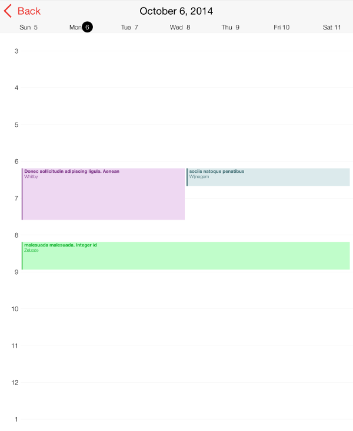
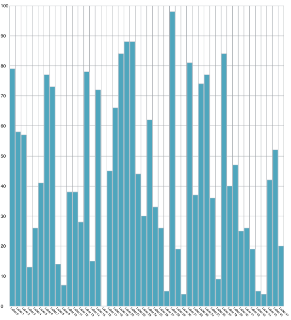
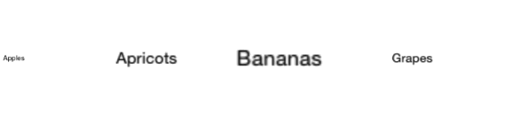
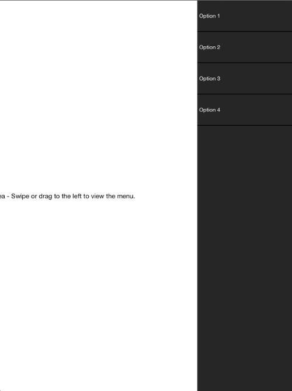

////

|metadata|
{
    "name": "whats-new-2014-2",
    "controlName": [],
    "tags": [],
    "guid": "833cb9b3-0235-4366-b286-dea1b1078199",  
    "buildFlags": [],
    "createdOn": "2014-09-10T14:55:46.6746143Z"
}
|metadata|
////

= 2014 Volume 2

== New Features Summary

=== New features summary chart

The following table summarizes the new features of the NucliOS 2014 Volume 2. Additional details are available following the summary table.

[options="header", cols="a,a,a"]
|====
|Control|Feature|Description

|<<_Ref256319450,IGCalendarView>>
|<<_Ref272391424,Custom Appointment Color>>
|Added in 2014 Volume 2 the IGCalendarView now supports custom appointment colors for each appointment.

|<<_Ref256319458,IGChartView>>
|<<_Ref272391433,Date Axis Support for Range and Stacked Series>>
|Date axis support was added to the _IGChartView_ in 2014 Volume 2 for the range and stacked series.

|
|<<_Ref272391444,Smart Axis Label Panel>>
|In 2014 Volume 2 the _IGChartView_ can dynamically layout axis labels to prevent collision when the smart axis label panel is enabled.

|<<_Ref223421047,IGGridView>>
|<<_Ref272391455,Cell Location within the Viewport>>
|The _IGGridView_ has added functionality in 2014 Volume 2 to allow a cell to control how its displayed based on its location within the grid’s viewport.

|<<_Ref272391403,IGSideMenuView>>
|<<_Ref256319682,New Control>>
|The new _IGSideMenuView_ allows for placing a menu on the left or right side of the view that can be exposed or hidden through interaction or code.

|====

[[_Ref256319450]]
== IGCalendarView

[[_Ref272391424]]

=== Custom Appointment Color

Added in 2014 Volume 2 the  _IGCalendarView_   now supports custom appointment colors for each appointment.

==== Related Topics:

* link:igcalendarview-configuring-custom-appointment-color.html[Configuring a Custom Appointment Color]

[[_Ref256319458]]
== IGChartView

[[_Ref272391433]]

=== Date Axis Support for Range and Stacked Series

Date axis support was added to the IGChartView in 2014 Volume 2 for the range and stacked series.

==== Related Topic:

* link:igchartview-data-source-helpers.html[Data Source Helpers]

[[_Ref272391444]]

=== Smart Axis Label Panel

In 2014 Volume 2 the  _IGChartView_   can now dynamically layout axis labels to prevent collision with the enabling of the smart axis label panel.

==== Related Topic:

* link:igchartview-configuring-smart-axis-label-panel.html[Configuring the Smart Axis Label Panel]

[[_Ref223421047]]
== IGGridView

[[_Ref272391455]]

=== Cell Location within the Viewport

The  _IGGridView_   has added functionality in 2014 Volume 2 to allow a cell to control how its displayed based on its location within the grid’s viewport.

==== Related Topics:

* link:iggridview-configuring-cell-location-viewport.html[Configuring the Cell Location within the Viewport]

[[_Ref272391403]]
== IGSideMenuView

[[_Ref256319682]]

=== New Control

The new  _IGSideMenuView_   allows for placing a menu on the left or right side of the view that can be exposed or hidden through interaction or code.

==== Related Topic:

* link:igsidemenuview.html[IGSideMenuView]