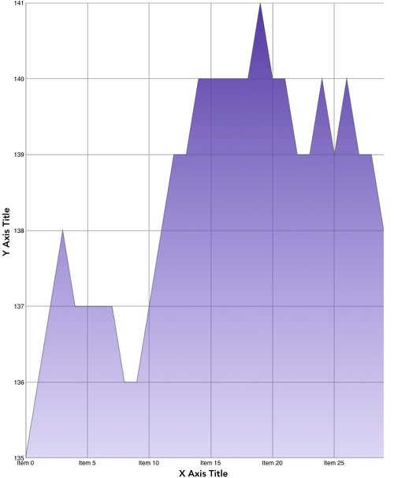

////

|metadata|
{
    "name": "whats-new-2015-1",
    "controlName": [],
    "tags": [],
    "guid": "5e06bb82-dfa4-47c2-91d3-b7b85dd4663b",  
    "buildFlags": [],
    "createdOn": "2015-03-24T14:34:10.9246452Z"
}
|metadata|
////

= 2015 Volume 1

== New Features Summary

=== New features summary chart

The following table summarizes the new features of the NucliOS 2015 Volume 1. Additional details are available following the summary table.

[options="header", cols="a,a,a"]
|====
|Control|Feature|Description

|<<_Ref223405955,IGChartView>>
|<<_Ref289343031,Axis Titles>>
|Axis titles support was added to the _IGChartView_ in 2015 Volume 1.

|
|<<_Ref289343044,Category Axis Clustering Mode>>
|With 2015 Volume 1 the _IGChartView_ has added functionality to render the line and area based series to draw their vertices in the center of each category.

|
|<<_Ref289343053,Hiding Invalid Data in the Financial Price Series>>
|In 2015 Volume 1 the _IGChartView_ has the option of hiding invalid data in the financial price series.

|
|<<_Ref289343063,Initial Animation>>
|With 2015 Volume 1 functionality was added to the IGChartView to animate category series values into position.

|<<_Ref223421047,IGGridView>>
|<<_Ref289343073,Fixed Rows>>
|The _IGGridView_ was updated to include functionality for allowing rows to be fixed to the top of the grid.

|
|<<_Ref289343081,Single Field Dynamic Data Source Helper>>
|The _IGGridView_ has a new data source helper that figures out the number of columns that would fit in a row with given the grid’s width.

|
|<<_Ref289343093,Swipe Row Functionality Update>>
|The _IGGridView_ has updated functionality in 2015 Volume 1 to further control whether swipe row functionality can occur for a given row.

|<<_Ref289342958,IGPieChartView>>
|<<_Ref289343106,Pie Slices with Zero Values in the Legend>>
|In 2015 Volume 1 the _IGPieChartView_ has added functionality to show pie slices with zero values in the legend.

|====

[[_Ref223405955]]
== IGChartView

[[_Ref289343031]]

=== Axis Titles

Axis titles support was added to the  _IGChartView_   in 2015 Volume 1 that allows a custom string to appear next to the X or Y-axis.

==== Related Topic:

* link:igchartview-configuring-axis-titles.html[Configuring Axis Titles]

[[_Ref289343044]]

=== Category Axis Clustering Mode

Category axis clustering mode allows the line and area based series to draw their vertices in the center of each category. Typically, the line series starts and ends at the very edge of the viewport.

==== Related Topics:

* link:igchartview-configuring-category-axis-clustering-mode.html[Configuring Category Axis Clustering Mode]

[[_Ref289343053]]

=== Hiding Invalid Data in the Financial Price Series

OHLC points have always been allowed to show in the chart regardless of the underlying values. However, a financial chart should not show points where the low value is greater than high value. In 2015 Volume 1, the OHLC data source helper has updated functionality to hide invalid data values.

==== Related Topics:

* link:igchartview-hiding-invalid-data-financial-price-series.html[Hiding Invalid Data in the Financial Price Series]

[[_Ref289343063]]

=== Initial Animation

Initial animation occurs during the rendering of data and allows your data points to animate into their value positions.

==== Related Topic:

* link:igchartview-configuring-initial-animation.html[Configuring Initial Animation]

[[_Ref223421047]]
== IGGridView

[[_Ref289343073]]

=== Fixed Rows

Fixed rows allow end-users to pin rows to the top of the  _IGGridView_  . These rows will stay locked into position when the grid is scrolled.

==== Related Topics:

* link:iggridview-configuring-fixed-rows.html[Configuring Fixed Rows]

[[_Ref289343081]]

=== Single Field Dynamic Data Source Helper

The single field multi column data source helper figures out the number of columns automatically instead of you having to specify. By setting the target width for the column, the data source helper will figure out how many columns can fit in a specific row automatically based on the width of the grid.

==== Related Topics:

* link:iggridview-data-helpers.html[Data Helpers]

[[_Ref289343093]]

=== Swipe Row Functionality Update

Swipe row functionality has been updated to further control which rows allow swipe row behavior by providing additional delegate methods.

==== Related Topics:

* link:iggridview-configuring-swipe-row.html[Configuring Swipe Row]

[[_Ref289342958]]
== IGPieChartView

[[_Ref289343106]]

=== Pie Slices with Zero Values in the Legend

When the  _IGPieChartView_   creates its slices and legend items the pie chart skips all zeroes. With the 2015 Volume 1 release the  _IGPieChartView_   has added functionality to show pie slices with zero values in the legend.

==== Related Topics:

* link:igpiechartview-showing-slices-zero-values-legend.html[Showing Slices with Zero Values in the Legend]