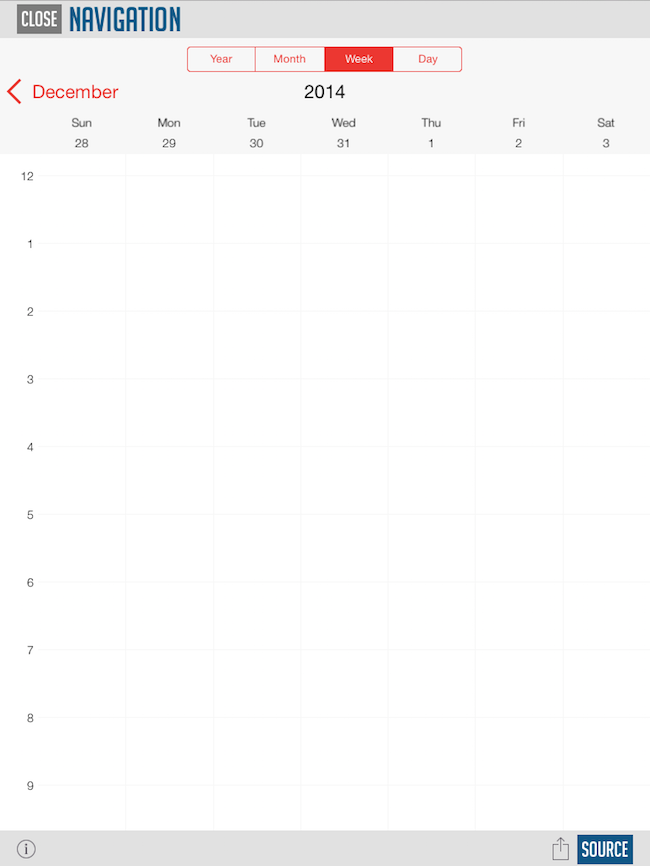

////

|metadata|
{
    "name": "whats-new-2015-2",
    "controlName": [],
    "tags": [],
    "guid": "fa7cd5a3-087a-4953-8893-34f4a8dc689c",  
    "buildFlags": [],
    "createdOn": "2015-09-18T14:36:11.2602323Z"
}
|metadata|
////

= 2015 Volume 2

== New Features Summary

=== New features summary chart

The following table summarizes the new features of the NucliOS 2015 Volume 2. Additional details are available following the summary table.

[options="header", cols="a,a,a"]
|====
|Control|Feature|Description

|<<_Ref289342901,Framework>>
|iOS 9
|2015 Volume 2 is updated for iOS 9 support.

|
|Objective-C Generics
|API headers have been updated to better describe array properties and parameteres.

|
|Swift 2.0
|Our APIs have also been updated to support the latest Swift enhancements.

|<<_Ref289342999,IGCalendarView>>
|Week View
|A new calendar view has been added in 2015 Volume 2.

|
|Work Hour Styling
|Support was added to the day view and week view for custom styling during work hours.

|<<_Ref223405955,IGChartView>>
|Axis Padding
|Extra space is now supported to better seperate the axis lines from the chart data.

|
|Improved Smart Axis
|Smart axis labels now support new line characters.

|<<_Ref289342958,IGFlowLayoutView>>
|Maximized Item
|IGFlowLayoutView cells now support maximizing.

|====

[[_Ref289342901]]
== Framework

[[_Ref289343101]]

=== iOS 9

The NucliOS frameworks have been built against iOS 9 and require Xcode 7. Bitcode support was also included with this release.

[[_Ref289343103]]

=== Objective-C Generics

Our public APIs have been updated to better describe array properties and parameters, taking full advantage of the Objective-C generics support.

[[_Ref289343102]]

=== Swift 2.0

The public APIs have been updated to take full advantage of the new Swift 2.0 and provide much more specific properties and parameters.

[[_Ref289342999]]
== IGCalendarView

[[_Ref289343199]]

=== Week View

The  _IGCalendarView_   now includes a week view.

==== Related Topics:

* link:igcalendarview-navigating-calendar.html[Navigating the Calendar]

[[_Ref289343198]]

=== Work Hour Styling

In the  _Day View_   and  _Week View_   support has been added to allow specifying the work hours for style customization.

[[_Ref223405955]]
== IGChartView

[[_Ref289343031]]

=== Axis Padding

Axis padding functionality has been added in 2015 Volume 2 to provide customizable space between the axis lines and chart data.

[[_Ref289343044]]

=== Improved Smart Axis

Smart axis labels now allow for new line characters to support multi-line labeling.

[[_Ref289342958]]
== IGFlowLayoutView

[[_Ref289343106]]

=== Maximized Item

Starting with 2015 Volume 2, the cells of the  _IGFlowLayoutView_   can be maximized and scroll through.

