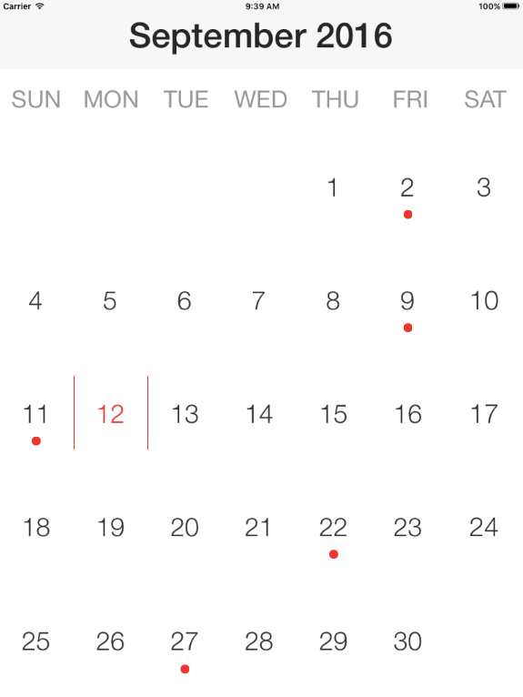

////
|metadata|
{
    "name": "whats-new-2016-volume-2",
    "controlName": [],
    "tags": [],
    "guid": "84adea1a-0829-4b3e-8442-d73bee856232",  
    "buildFlags": [],
    "createdOn": "2016-09-13T17:15:32.1510148Z"
}
|metadata|
////

= 2016 Volume 2

== New Features Summary

=== New features summary chart

The following table summarizes the new features of the NucliOS 2016 Volume 2. Additional details are available following the summary table.

[options="header", cols="a,a,a"]
|====
|Control|Feature|Description

|<<_Ref446494935,IGCompactCalendarView>>
|<<_Ref320517942,New Control>>
|The _IGCompactCalendarView_ control displays a month in a compact format.
|====

[[_Ref446494935]]
== IGCalendarView

[[_Ref320517942]]

=== New Control

The _IGCompactCalendarView_ is a view that displays a month in a compact format. Unlike the _IGCalendarView_ you cannot navigate to different views. Instead, the control allows you to quickly look through a calendar and see what days you have appointments.

==== Related Topics:

* link:igcompactcalendarview-adding-compact-calendar-view.html[Adding the Compact Calendar to a View]
* link:igcompactcalendarview-adding-meetings-compact-calendar.html[Adding Meetings to the Compact Calendar]